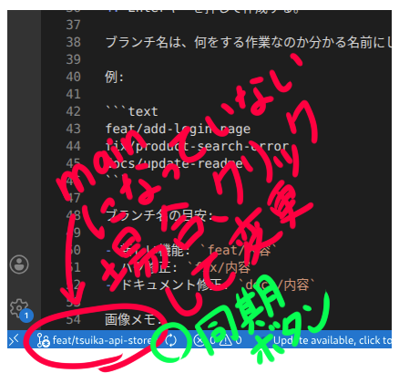
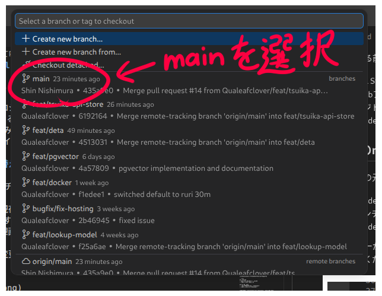
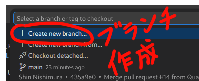
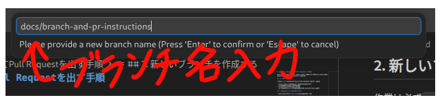
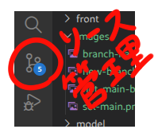
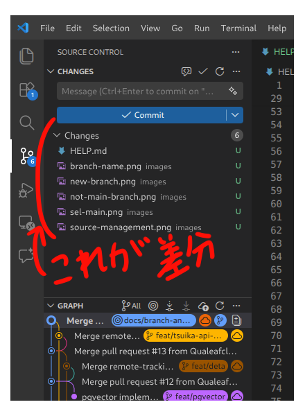
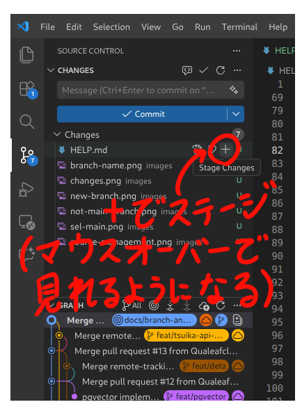
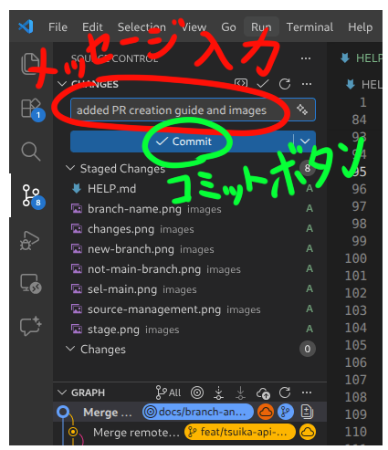

# GitHubでブランチを作成してPull Requestを出す手順

このドキュメントは、Visual Studio Codeの画面操作を中心に、ブランチ作成からPull Request（PR）作成までを説明するものです。

## 事前準備

作業を始める前に、次の状態になっていることを確認してください。

- Visual Studio Codeでこのプロジェクトを開いている
- GitHubアカウントにログインできる
- リポジトリを自分のPCにclone済み
- VS Code左側の「ソース管理」アイコンからGitの状態を確認できる

## 1. 最新のmainブランチに切り替える

まず、作業の元になる`main`ブランチを最新にします。

1. VS Code左下に表示されている現在のブランチ名をクリックする。
2. ブランチ一覧から`main`を選択する。
3. VS Code左下、またはソース管理画面にある同期ボタンを押して、最新の状態を取得する。

ここでエラーが出た場合は、自分の変更が残っている可能性があります。無理に進めず、チームメンバーに確認してください。

画像メモ:




## 2. 新しいブランチを作成する

作業は必ず`main`ではなく、新しいブランチで行います。

1. VS Code左下のブランチ名をクリックする。
2. 表示されたメニューから「新しいブランチの作成」を選択する。
3. ブランチ名を入力する。
4. Enterキーを押して作成する。

ブランチ名は、何をする作業なのか分かる名前にしてください。

例:

```text
feat/add-login-page
fix/product-search-error
docs/update-readme
```

ブランチ名の目安:

- 新しい機能: `feat/内容`
- バグ修正: `fix/内容`
- ドキュメント修正: `docs/内容`

画像メモ:




## 3. ファイルを編集する

作成したブランチ上で、必要なファイルを編集します。

注意点:

- 関係ないファイルは変更しない
- 一度に大きすぎる変更をしない
- 何を変更したか自分で説明できる状態にする

## 4. 変更内容を確認する

変更が終わったら、コミットする前に差分を確認します。

1. VS Code左側の「ソース管理」アイコンをクリックする。
2. 変更されたファイル一覧を確認する。
3. 各ファイルをクリックして、変更内容を確認する。

不要な変更が入っていた場合は、そのファイルを元に戻すか、必要な部分だけ残してください。

画像メモ:




## 5. 変更をステージする

コミットに含めるファイルを選びます。

1. ソース管理画面で、コミットしたいファイルの横にある`+`ボタンを押す。
2. すべての変更をまとめて入れる場合は、「変更」の横にある`+`ボタンを押す。

ステージしたファイルだけが次のコミットに含まれます。

画像メモ:



## 6. コミットする

コミットは、変更内容をGitに記録する操作です。

1. ソース管理画面上部のメッセージ入力欄に、変更内容を書く。
2. 「コミット」ボタンを押す。

コミットメッセージは短く分かりやすく書いてください。

例:

```text
商品検索画面のレイアウトを修正
ログインページを追加
READMEに起動手順を追加
```

良くない例:

```text
修正
いろいろ変更
test
```

画像メモ:



## 7. ブランチをGitHubにアップロードする

コミットしただけでは、まだ自分のPC内にしか変更がありません。GitHubにアップロードします。

1. VS Code左下、またはソース管理画面に表示される「ブランチの発行」または「Publish Branch」を押す。
2. 処理が終わるまで待つ。

これで、自分のブランチがGitHub上に作成されます。

画像メモ:

- ここに「Publish Branch」の画像を追加

## 8. GitHubのブラウザ画面を開く

次に、ブラウザでGitHubを開いてPRを作成します。

1. ブラウザでGitHubのリポジトリページを開く。
2. 自分のブランチがアップロードされている場合、上部に「Compare & pull request」ボタンが表示されることがあります。
3. 表示されている場合は、そのボタンを押す。

表示されていない場合:

1. GitHubのリポジトリページで「Pull requests」タブを開く。
2. 「New pull request」ボタンを押す。
3. `base`が`main`、`compare`が自分の作業ブランチになっていることを確認する。

画像メモ:

- ここに「Compare & pull request」の画像を追加
- ここに「Pull requestsタブ」の画像を追加
- ここに「baseとcompareの選択画面」の画像を追加

## 9. Pull Requestを作成する

PR作成画面では、タイトルと説明を書きます。

確認すること:

- `base`が`main`になっている
- `compare`が自分のブランチになっている
- 変更した内容が正しく表示されている
- 関係ないファイルが含まれていない

PRタイトルには、何を変更したかを書いてください。

例:

```text
商品検索画面のレイアウトを修正
ログインページを追加
```

説明欄には、次のように書くと分かりやすいです。

```text
## 変更内容
- 商品検索画面の表示崩れを修正
- 検索ボタンの配置を調整

## 確認したこと
- 画面が正しく表示されることを確認
- 検索ボタンが押せることを確認
```

内容を書いたら、「Create pull request」ボタンを押します。

画像メモ:

- ここに「PRタイトルと説明欄」の画像を追加
- ここに「Create pull requestボタン」の画像を追加

## 10. PRを出した後にすること

PRを作成したら、チームメンバーに確認してもらいます。

やること:

- チームのチャットなどでPRを出したことを伝える
- レビューコメントが来たら対応する
- 自分で勝手に`main`へマージしない

## よくある注意点

### mainブランチで直接作業しない

`main`は完成したコードを置くためのブランチです。作業は必ず新しいブランチで行ってください。

### コミット前に差分を見る

意図しないファイルが変更されていないか確認してください。特に設定ファイルや自動生成ファイルが混ざっていないか注意してください。

### PRを作る前にGitHubへアップロードする

VS Codeでコミットしただけでは、GitHubには反映されません。必ず「Publish Branch」または同期操作を行ってください。

### 分からないエラーが出たら止まる

Gitのエラーは、適当にボタンを押すと状態が悪くなることがあります。分からない場合は、エラー画面のスクリーンショットを撮って相談してください。

## 作業の流れまとめ

```text
mainに切り替える
↓
最新状態に同期する
↓
新しいブランチを作る
↓
ファイルを編集する
↓
変更内容を確認する
↓
ステージする
↓
コミットする
↓
Publish BranchでGitHubにアップロードする
↓
GitHubのブラウザ画面でPRを作る
↓
レビューしてもらう
```
