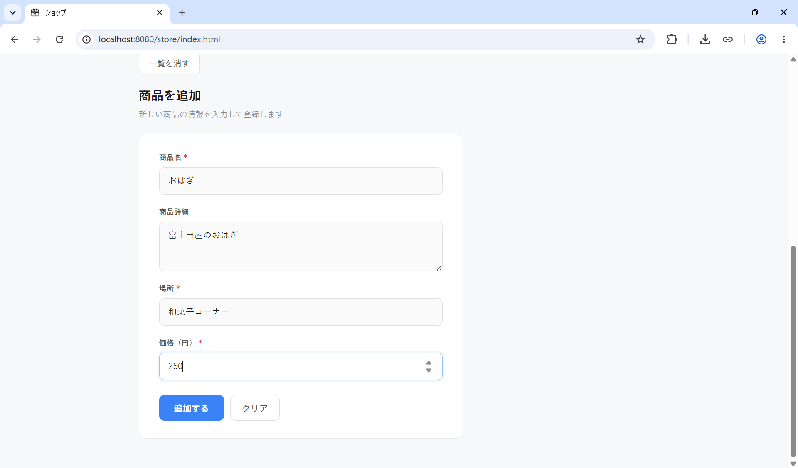
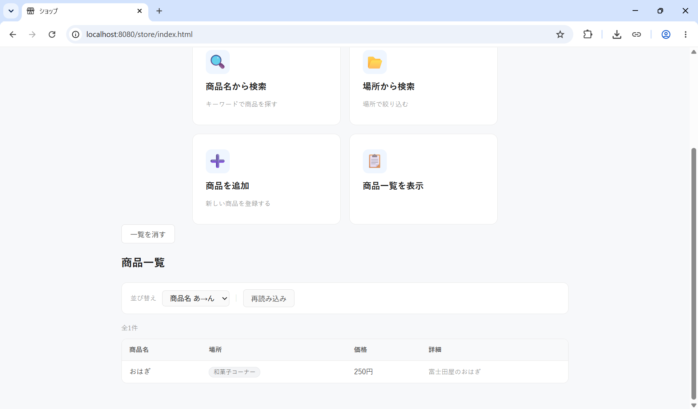
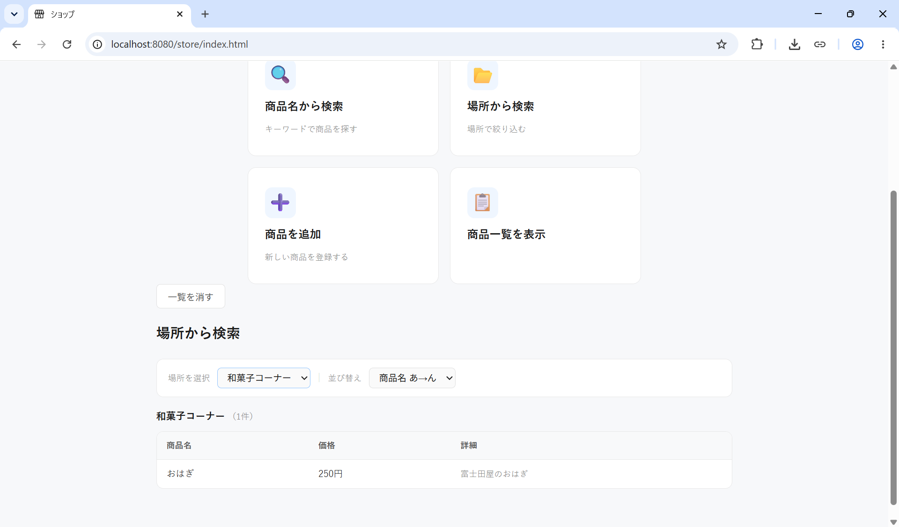
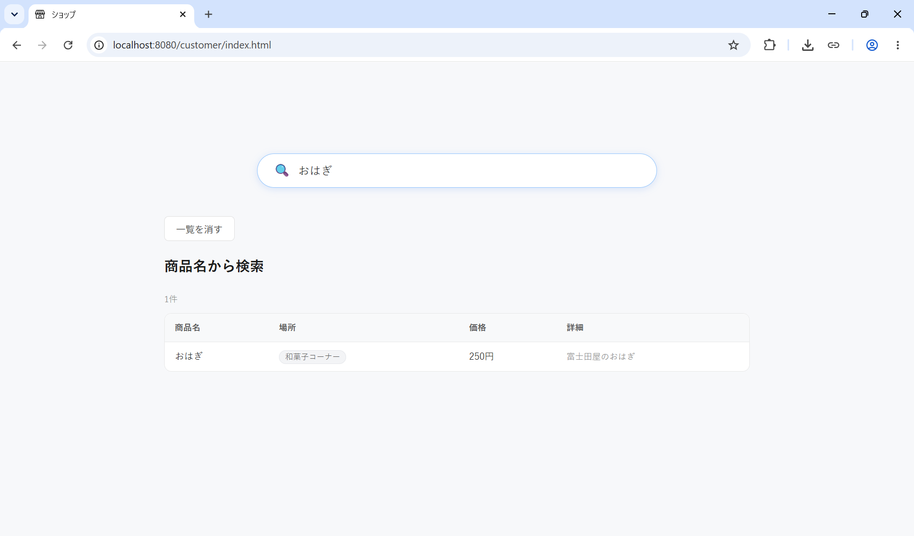

# Store Product Lookup

商品検索用の Web アプリです。Docker Compose で Node.js バックエンド、PostgreSQL、フロントエンド、量子化済み ONNX モデルをまとめて起動します。

Node.js や PostgreSQL をローカルに直接インストールする必要はありません。

## 必要なもの

- Docker / Docker Compose
- Git
- make / wget / unzip

## 1. Docker を用意する

### Ubuntu / Debian

Docker Engine をインストールします。

- Ubuntu: https://docs.docker.com/engine/install/ubuntu/
- Debian: https://docs.docker.com/engine/install/debian/

必要な補助コマンドも入れておきます。

```bash
sudo apt update
sudo apt install -y git make wget unzip
```

Docker の確認:

```bash
docker --version
docker compose version
```

Linux では環境によって `docker` に `sudo` が必要です。権限エラーが出る場合は、README 内の `docker compose` を `sudo docker compose` に置き換えてください。

### Windows

Docker Desktop + WSL 2 を使います。

- Docker Desktop for Windows: https://docs.docker.com/desktop/setup/install/windows-install/
- WSL 2 backend: https://docs.docker.com/desktop/features/wsl/

PowerShell を管理者として開き、WSL が未導入なら有効化します。

```powershell
wsl --install
```

その後、Docker Desktop で WSL 2 backend を有効にしてください。

プロジェクトは Windows の `C:\Users\...` ではなく、WSL の Linux 側に置くことを推奨します。

```text
/home/<user>/Store-Product-Lookup
```

## 2. プロジェクトを取得する

```bash
git clone https://github.com/Qualeafclover/Store-Product-Lookup.git
cd Store-Product-Lookup
```

## 3. モデルをダウンロードする

通常の実行だけなら、量子化済みモデルをダウンロードするだけで十分です。

```bash
make download-model
```

以下にモデルが展開されます。

```text
model/quantized/ruri-v3-310m/
```

必要ファイル:

```text
config.json
model_quantized.onnx
ort_config.json
special_tokens_map.json
tokenizer.json
tokenizer.model
tokenizer_config.json
```

確認:

```bash
ls model/quantized/ruri-v3-310m
```

自分で量子化する場合は `model/quantize.py` を使います。量子化に必要な Python 環境や `uv` の準備は Docker 起動とは別作業です。

## 4. 起動する

```bash
docker compose up --build
```

Linux で権限エラーが出る場合:

```bash
sudo docker compose up --build
```

## 5. 店舗 UI から商品追加
ブラウザで店舗用URLにアクセスします。
```text
http://localhost:8080/store/index.html
```

商品を追加から商品追加画面に移行します。



追加された商品は一覧を表示から確認できます。


商品名や商品の場所から検索することもできます。
//キーワードが入力され、結果がでた画像




## 6. 消費者 UI から商品検索
ブラウザで店舗用URLにアクセスします。
```text
http://localhost:8080/store/index.html
```

検索バーからほしい商品の名前を入力します。

場所や価格、商品の詳細などが分かります。

```

## よく使うコマンド

停止:

```bash
docker compose down
```

バックグラウンド起動:

```bash
docker compose up --build -d
```

ログ確認:

```bash
docker compose logs app
docker compose logs db
```

起動中のコンテナ確認:

```bash
docker compose ps
```

データベースも含めて初期化:

```bash
docker compose down -v
docker compose up --build
```

`down -v` は PostgreSQL の保存データを削除します。データベースを作り直したい時だけ使ってください。

### データベース関連

データベースにアクセス: \
なお、パスワードは `docker-compose.yml` に記述されています

```bash
psql -h localhost -p 5432 -U postgres -d postgres
```

`store_product_lookup` データベースにアクセス:

```sql
\c store_product_lookup
```

`products` テーブルのスキーマ表示:

```sql
\d products
```

コサイン近似度検索: \
なお、`<=>` がコサイン近似度の意味を持つ

```sql
SELECT * FROM products ORDER BY encoded_vector <=> '[0.3, 0.2, -0.1]'::VECTOR LIMIT 3;
```

## 補足

`docker-compose.yml` は 2 つのサービスを起動します。

- `app`: `services/Dockerfile` からビルドされる Node.js アプリ
- `db`: 公式の `postgres:16` イメージを使う PostgreSQL

PostgreSQL は公式イメージを使うため、Dockerfile は `services/Dockerfile` の 1 つだけです。

フロントエンドは `front/` にありますが、ブラウザで開く URL は `/front/...` ではありません。

```text
http://localhost:8080/customer/index.html
http://localhost:8080/store/index.html
```
